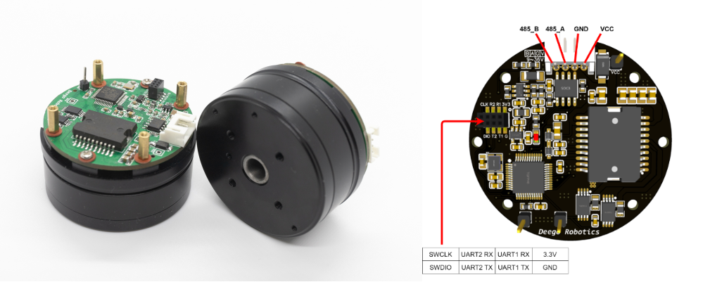

# DeegoFOC开发平台使用手册

**作者:** [Deego Robotics](https://github.com/Deego-Robotics)

**2021/12/30**: 建立仓库

DeegoFOC是一款适配 [SimpleFOC](https://simplefoc.com/) 的一体闭环无刷电机开发平台，主控为 **STM32F103C8T6** ，采用高性价比的 **TLE5012B** 作为磁编码器，具备 **电流采样** 功能；本教程使用强大的 [PlatformIO](https://platformio.org/) 配合 VSCode 进行开发，无需繁琐的环境配置过程。当然，有能力的朋友也可以直接使用原生STM32开发工具进行开发，这里就不展开讨论。

因个人水平有限，实验中的控制参数可能并不是最优，请多多包涵！

祝朋友们玩得开心，代码无BUG！

### 参考开源项目：

1. [btt-s42b-simplefoc](https://github.com/xerootg/btt-s42b-simplefoc) 本教程中，磁编码器读取部分参考了该仓库
2. [SimpleFOC](https://simplefoc.com/) 本教程的例程改写自官方例程

### 目录：

​	准备、[开发环境配置](docs/0_environment.md)

​	一、[引脚定义](docs/1_pinout.md)

​	二、[传感器测试实验](docs/2_encoder_test.md)

​	三、[速度开环控制实验](docs/3_velocity_openloop.md)

​	四、[速度电压闭环控制实验](docs/4_velocity_closeloop_voltage.md)

​	五、[速度电流闭环控制实验](docs/5_velocity_closeloop_current.md)

​	六、[位置电流闭环控制实验](docs/6_position_closeloop_current.md)
