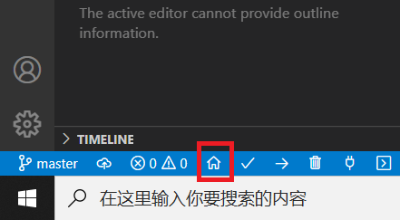
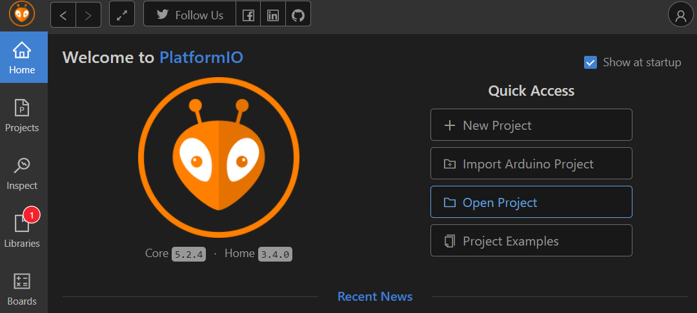
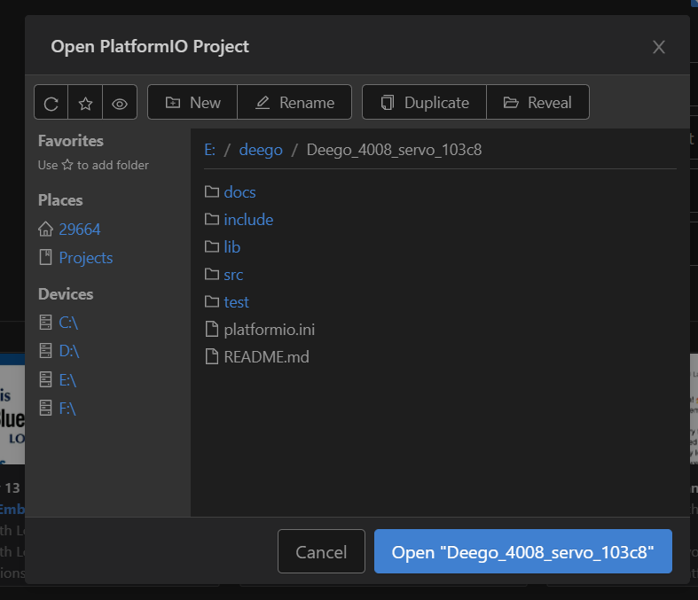
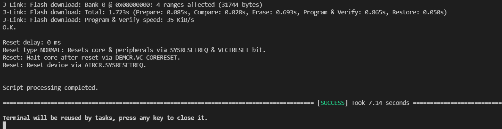

# 开发环境配置

### 1 安装 Visual Studio Code 以及 PlatformIO

可以参考博客 [PlatformIO平台下Arduino的开发过程-基于Visual Studio Code平台](https://blog.csdn.net/weixin_41598714/article/details/97641453)

**注：这一步只需要进行到安装PlatformIO结束，无需创建新的工程**

### 2 导入本项目

首先，点击VSCode界面左下角的 `HOME` 图标，进入 PlatformIO 主界面：

接下来点击 `Open Project` ，在选择框中选中本仓库代码所在的文件夹

成功打开工程后，左边工作区将出现 `Deego_4008_servo_103c8` 所示的工程

（工程默认使用 jlink对设备进行烧写）

### 3 项目使用方式

做每个实验前，将 main.cpp 中的代码替换为实验的代码，连接 jlink后，点击左下角的 `->` 上传 (Upload) 标记即可烧写程序。

烧写成功后，终端将输出：

