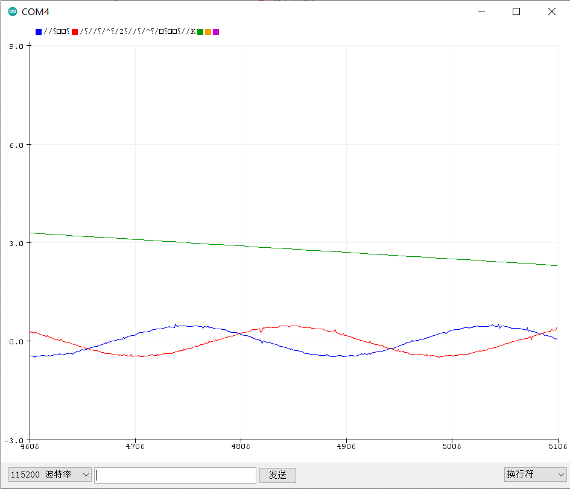

# 传感器测试实验

使用速度开环模式控制电机匀速转动，同时采集电流与位置信息并输出

```c++
// 传感器测试实验

#include <Arduino.h>
#include <SimpleFOC.h>
#include <TLE5012b.h>
#include <config.h>

TLE5012B sensor = TLE5012B();

HardwareSerial Serial1(RS485_RX_PIN, RS485_TX_PIN);


// BLDC motor & driver instance
// BLDCMotor motor = BLDCMotor(pole pair number);
BLDCMotor motor = BLDCMotor(11);

// BLDCDriver3PWM driver = BLDCDriver3PWM(pwmA, pwmB, pwmC, Enable(optional));
BLDCDriver3PWM driver = BLDCDriver3PWM(PWM_A_PIN, PWM_B_PIN, PWM_C_PIN, DRIVER_EN_PIN);

InlineCurrentSense current_sense  = InlineCurrentSense(0.01, 50, CURRENT_SENSE_A_PIN, CURRENT_SENSE_B_PIN);

//target variable
float target_velocity = 1.0;

void setup() {

  initPorts();

  sensor.init();

  // driver config
  // power supply voltage [V]
  driver.voltage_power_supply = 12;
  driver.init();
  // link the motor and the driver
  motor.linkDriver(&driver);

  // limiting motor movements
  motor.voltage_limit = 3;   // [V]
  motor.velocity_limit = 5; // [rad/s] cca 50rpm
 
  // open loop control config
  motor.controller = MotionControlType::velocity_openloop;

  // init motor hardware
  motor.init();

  current_sense.init();

  RS485_ON;

  Serial1.begin(115200);
  Serial1.println("Motor ready!");

  _delay(1000);

  LED_ON;

}

void loop() {

  // open loop velocity movement
  // using motor.voltage_limit and motor.velocity_limit
  motor.move(target_velocity);

  PhaseCurrent_s currents = current_sense.getPhaseCurrents();

  Serial1.print(currents.a);
  Serial1.print(" ");
  Serial1.print(currents.b);
  Serial1.print(" ");
  Serial1.println(sensor.getRawCount() * 6.28 / 16384.0);

  delay(1);
}
```

## 效果



可以看到变化的位置与电流波形
